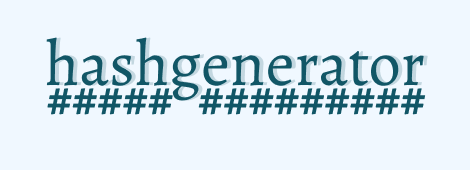

<div align="center">
    
</div>

<div align="center">
    <a href="https://github.com/Gustavo-Henrique-br" >
        
    </a>
    <a href="https://github.com/Gustavo-Henrique-br/passwordgenerator/stargazers"></a>
</div>

<div align="center">
    <h1>🔐 HashGenerator 🔐</h1>
    <p>Simples projeto em javascript puro, html e css, treino de <b>webpack e babel</b></p>
</div>
<hr />

<div align="center">
    <h4>✨ Finalizado ✨</h4>
</div>

<hr />

Tabela de conteúdos
=================
<!--ts-->
   * [Features](#features)
   * [Rodando](#rodando)
   * [Como usar](#como-usar)
      * [Site](#deploy)
      * [Pre Requisitos](#pre-requisitos)
      * [Instalando](#install)
   * [Tecnologias](#techs)
<!--te-->

<div id="features" align="center">
    <h1>📰 Features</h1>
</div>

- [X] Geracao de hash
- [X] Testes unitarios ([Mocha](https://mochajs.org/) e [Chai](https://mochajs.org/))
- [ ] refatorar geracao de hash (para garantir que toda funcao seja chamada uma vez numa posicao randomica)

<div id="rodando" align="center">
    <h1>🎲 Rodando</h1>
</div>

<h3 align="center">veja tambem o site online <a id="deploy" alt="https://gustavo-henrique-br.github.io/passwordgenerator/" href="https://gustavo-henrique-br.github.io/passwordgenerator/">Aqui</a></h3>

<div id="pre-requisitos" align="center">
    <h4>Pré-requisitos</h4>
</div>

Antes de começar, você vai precisar ter instalado em sua máquina as seguintes ferramentas:
[Git](https://git-scm.com), [Node.js (npm)](https://nodejs.org/en/).
Além disto é bom ter um editor para trabalhar com o código, como o [VSCode](https://code.visualstudio.com/)

<div id="install" align="center">
    <h4>
        siga esses passos para instalar:
    </h4>
</div>

```bash
# clonando o projeto na sua maquina
$ git clone https://github.com/Gustavo-Henrique-br/passwordgenerator.git

# instale as dependencias com:
$ yarn install
# ou
$ npm install

# minificando o codigo e rodando
$ yarn build && yarn dev
# ou
$ npm run build && npm run dev
```

### Nota: basta voce abrir no seu browser, mas recomendo usar uma ferramenta de hot reload, como o [Live server](https://marketplace.visualstudio.com/items?itemName=ritwickdey.LiveServer)

<div id="techs" align="center">
    <h1>🛠 Tecnologias</h1>
</div>

- [Webpack](https://webpack.js.org/)
- [Babel](https://babeljs.io/)
- [Mocha](https://mochajs.org/)
- [Chai](https://mochajs.org/)